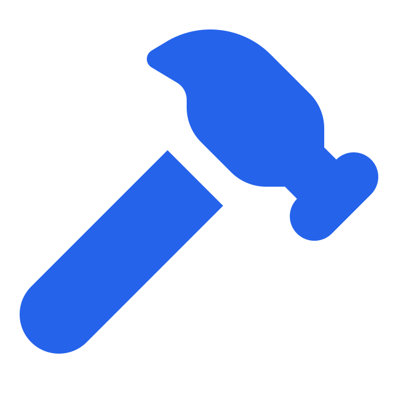
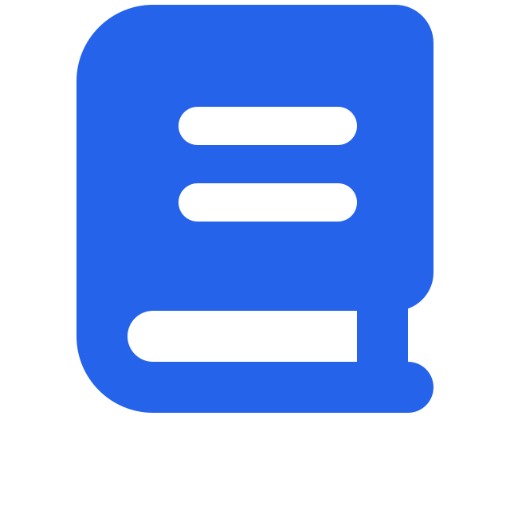
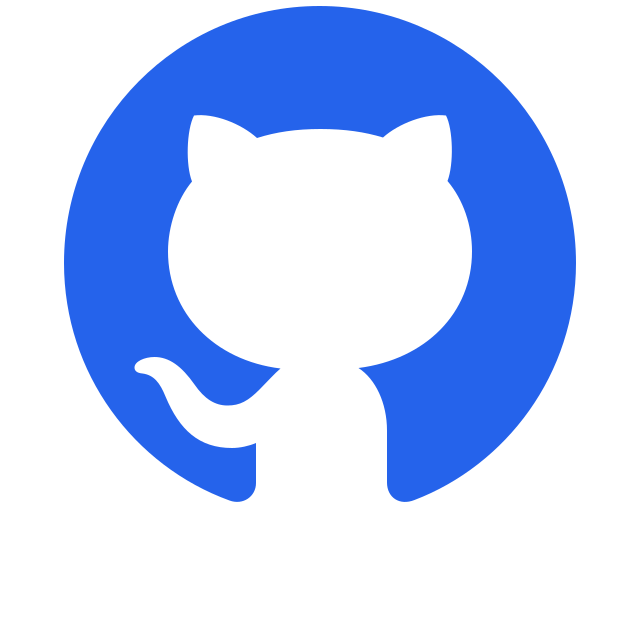
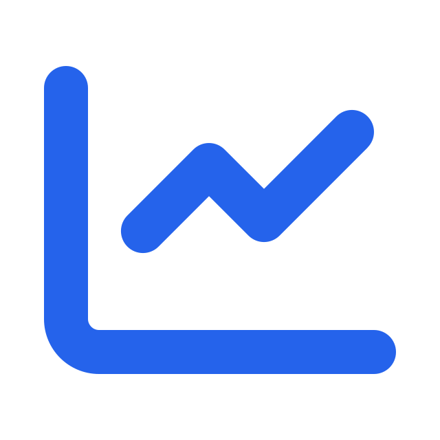

 

### Desenvolvedor de Sistemas em formação

**Ciência da Computação • Desenvolvimento Web • Sistemas**

 

---

<h2>
  
  Sobre mim
</h2>

Sou estudante de **Ciência da Computação** e desenvolvedor de sistemas em formação.

Tenho interesse principalmente em **desenvolvimento web, sistemas e bancos de dados**, buscando transformar o conhecimento adquirido nos estudos em projetos reais.

Atualmente estou aprofundando meus conhecimentos em **PHP, MySQL, C e Python**, além de trabalhar constantemente com Git e GitHub.

Meu objetivo é evoluir como desenvolvedor através da criação de projetos, resolução de problemas e aprendizado contínuo.

---

<h2>
  
  Tecnologias
</h2>

<h3>
  
  Linguagens
</h3>

  

<h3>
  
  Banco de Dados & Ferramentas
</h3>

---

<h2>
  
  Projetos
</h2>

Atualmente estou desenvolvendo novos projetos para colocar em prática meus conhecimentos e construir meu portfólio.

<h3>
  
  Projetos em construção
</h3>

<table>
<tr>
<td width="50%" valign="top">

**Biblioteca Online**

**Concluído**

`PHP` `MySQL`

Concluído

</td>

<td width="50%" valign="top">

**Estoque para empresa de gás**

**Em desenvolvimento**

`PHP` `MySQL`

Em desenvolvimento

</td>
</tr>

<tr>
<td width="50%" valign="top">

**Sistema de Ordem de Serviço**

**Em desenvolvimento**

`PHP` `JavaScript` `MySQL`

Em desenvolvimento

</td>

<td width="50%" valign="top">

###  Próximo projeto

Novos projetos serão adicionados conforme forem desenvolvidos.

Em breve

</td>
</tr>
</table>

> Esta seção será atualizada conforme novos projetos forem concluídos.

---

<h2>
  
  Atualmente estudando
</h2>

`PHP` • `MySQL` • `C` • `Python` • `POO` • `Git` • `GitHub`

---

<h2>
  
  GitHub
</h2>

<picture>
  <source media="(prefers-color-scheme: dark)" srcset="https://raw.githubusercontent.com/JeanDev13/JeanDev13/output/github-snake-dark.svg">
  <source media="(prefers-color-scheme: light)" srcset="https://raw.githubusercontent.com/JeanDev13/JeanDev13/output/github-snake.svg">
  
</picture>

---

<h2>
  
  Minha evolução
</h2>

 

> **Code. Learn. Build. Repeat.**

